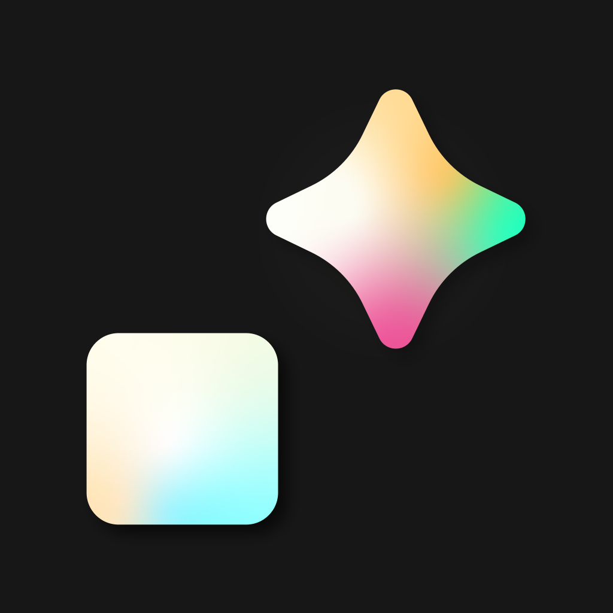
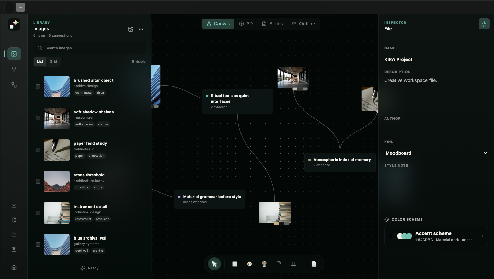

<p align="center">
  
</p>

<h1 align="center">KIRA</h1>

<p align="center">
  A calm visual workspace for turning references into connected ideas, outlines, and presentations.
</p>

<p align="center">
  <a href="https://github.com/vietx2811/kira/releases/tag/v1.0"><strong>Download KIRA 1.0</strong></a>
  ·
  <a href="#quick-start">Quick start</a>
  ·
  <a href="#build-from-source">Build from source</a>
</p>



KIRA brings references, thinking, structure, and presentation into one local-first macOS app. Import visual material, arrange it on a flexible canvas, connect evidence to ideas, then move the same project into 3D, Slides, or Outline without rebuilding the work.

## Features

### Visual research canvas

- Import images, folders, URLs, screenshots, and Eagle-style reference folders.
- Arrange ideas, references, frames, palettes, diagrams, placeholders, and stickers.
- Create links directly from node handles with smooth, readable paths.
- Move, resize, group, crop, tag, and inspect objects without leaving the canvas.
- Zoom with the wheel or trackpad and pan with the middle mouse button.

### One project, four views

- **Canvas** — organize references and build the idea graph.
- **3D** — explore relationships spatially.
- **Slides** — turn the current research structure into a presentation deck.
- **Outline** — review strong ideas, evidence gaps, and narrative order.

### Browser capture

- Capture pages and images from Chrome or Safari.
- Discover multiple images on the current page and filter by dimensions or format.
- Send captures to a selected KIRA node or keep them in the inbox.
- Show a clear “Open Kira App” state when the desktop app is not running.
- Safari Extension is embedded directly inside `KIRA.app`.

### Local-first workflow

- Native `.kira` project packages backed by normalized SQLite data.
- Local thumbnails, image fingerprints, duplicate detection, and recovery states.
- Optional Apple Vision OCR, Apple Natural Language, and Foundation Models helpers.
- Optional Codex, Claude Code, OpenAI, or Anthropic connections.
- Version checkpoints and branches for exploring directions without losing earlier work.

## Quick start

KIRA 1.0 is currently released for Apple Silicon Macs.

1. Download [`KIRA-1.0-macos-arm64.zip`](https://github.com/vietx2811/kira/releases/download/v1.0/KIRA-1.0-macos-arm64.zip).
2. Extract the archive and open Terminal in the extracted folder.
3. Sign the app for your current Mac:

   ```bash
   chmod +x sign-kira.sh
   ./sign-kira.sh
   ```

4. Move `KIRA.app` into `/Applications`.
5. Open KIRA and choose **Open the guided board** for a short interactive introduction.

The included script creates an ad-hoc signature for use on the machine that runs it. It also supports a Developer ID identity; see [`packaging/macos/HUONG-DAN.md`](packaging/macos/HUONG-DAN.md). The public 1.0 release is not notarized by Apple.

### Basic workflow

1. Create a board or open the guided example.
2. Add references from the Library drawer or paste them onto the canvas.
3. Create an idea node and drag from a node handle to connect supporting evidence.
4. Select any object to open its properties in the Inspector.
5. Switch between Canvas, 3D, Slides, and Outline as the project develops.
6. Save the project as a `.kira` package or export the resulting outline, contact sheet, or presentation.

### Enable Safari capture

1. Install and open the current `KIRA.app` once.
2. Open **Safari → Settings → Extensions**.
3. Enable **KIRA** and allow access to the sites where capture is needed.

### Enable Chrome capture

1. Open **KIRA Settings → Capture → Open bundled dist**.
2. Open `chrome://extensions`.
3. Enable **Developer mode**, choose **Load unpacked**, and select the folder KIRA opened.

When working from source, build the extension and load `apps/extension/dist` instead.

## Build from source

Requirements: Node.js, pnpm, Rust, Xcode, and the Tauri prerequisites for macOS.

```bash
pnpm install
pnpm dev
```

Run the native desktop shell:

```bash
pnpm --filter @kira/desktop tauri dev
```

Build the macOS app and embedded Safari Extension:

```bash
pnpm --filter @kira/desktop tauri build
```

Build only the Chrome/Safari web-extension resources:

```bash
pnpm --filter @kira/extension build
```

## Repository

```text
apps/
  desktop/       Tauri 2 + React desktop app
  extension/     Chrome MV3 and Safari Web Extension
  codex-helper/  Local Codex integration helper
packaging/
  macos/         Self-signing script and release instructions
docs/            Architecture, research, and design documentation
```

## Documentation

- [Architecture](docs/ARCHITECTURE.md)
- [Database schema](docs/DATABASE.md)
- [UI design system](docs/UI_DESIGN.md)
- [Moodboard UX research](docs/RESEARCH_MOODBOARD_UX.md)
- [macOS signing guide](packaging/macos/HUONG-DAN.md)

## Release information

- Version: **1.0**
- Developer: **VX Studio**
- Bundle identifier: `vxstudio.kira`
- Platform: macOS Apple Silicon
