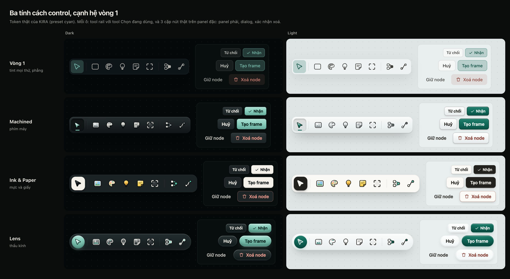

# Art direction vòng 2: ba tính cách control và tool rail có khối

- **Câu hỏi:** hệ control vòng 1 bị user chê "vô cảm, AI slop". Làm lại theo hướng B (Glass Chrome, Paper Content) sao cho có cảm xúc, primary và secondary phân biệt rõ, icon tool rail hơi skeuomorphic kiểu Figma, và user chọn được bằng mắt.
- **Người yêu cầu:** Orchestrator, thread Art Director vòng 2 (2026-09-14). Quyết định cuối thuộc user.
- **Commit đã kiểm chứng:** `4150b97` (main lúc bắt đầu; worktree được fast-forward từ `83455db` vì bản cũ chưa có công vòng 1). Token đọc từ app chạy trên commit này. Nguồn ngoài truy cập 2026-09-14.
- **Cách đo:** vite dev server của chính worktree ở cổng 5189 (chứng minh bằng file probe chỉ có trong worktree, đã xoá), Chrome headless điều khiển qua CDP bằng script Node stdlib. Specimen là file HTML tĩnh mở bằng `file://`.
- **Nhãn:** **[đo]** đo từ điểm ảnh render, **[code]** đọc repo, **[ngoài]** nguồn có link, **[suy luận]**.

Sản phẩm (thư mục [`art-direction/v2/`](art-direction/v2/)):
- Specimen: [`controls-v2.html`](art-direction/v2/controls-v2.html). Mở không tham số để xem tất cả; `?view=compare`, `?view=sheet&p=mach|ink|lens&t=dark|light`, `?view=context&p=…&t=…`.
- Ảnh so sánh: [`compare.jpg`](art-direction/v2/compare.jpg). Sheet trạng thái: `sheet-{mach,ink,lens}-{dark,light}.jpg`. Khung trong ngữ cảnh: `context-{mach,ink,lens}-dark.jpg`.
- Số đo thô: [`measure.json`](art-direction/v2/measure.json) (có cả khung light trong ngữ cảnh, không commit ảnh để giữ nhẹ).
- **Tổng dung lượng ảnh commit: 2.509.375 byte (khoảng 2,5 MB), 10 file JPEG 2x.**

---

## Kết luận ngắn

1. Vòng 1 trông vô cảm vì **mọi trạng thái là cùng một lớp tint teal trên nền gần đen**, primary tối hơn secondary, không có vật liệu, và icon là nét đơn đồng đều. Sửa màu chữ không giải quyết được; phải đổi *hình thái*.
2. Ba tính cách khác nhau thật sự, cùng dùng token thật: **Machined** (phím máy anodized, lún khi bấm, LED), **Ink & Paper** (primary là mực đặc trung tính, secondary là tờ giấy nhấc lên, icon có màu như sticker), **Lens** (capsule kính quang học kiểu macOS 26, primary sáng từ trong).
3. Đo trên điểm ảnh: **0 ô chữ dưới 4,5:1, 0 vòng focus dưới 3:1** ở cả 3 tính cách, dark và light, gồm cả rail đặt trên ảnh trắng hoặc đen tuyệt đối (số ở §C).
4. **Khuyến nghị: Ink & Paper**, vì primary và secondary tách bằng *độ sáng* chứ không bằng tint, accent teal được trả lại cho canvas, và rail icon màu khớp đúng câu "Figma style" lẫn DESIGN.md §2.4. Đổi nhiều luật DESIGN.md nhất về màu, nên cần user duyệt từng luật (§E).
5. **Icon: vẽ riêng 12 icon rail bằng SVG** (đã có bản nháp trong specimen), một hình học cho cả 3 chất liệu qua biến CSS; giữ Lucide cho glyph trong UI. Không dùng SF Symbols (§D).

---

## A. Vì sao vòng 1 đọc thành AI slop

Nhìn lại [`controls-dark.jpg`](art-direction/controls-dark.jpg) của vòng 1:

- **Một công thức cho mọi nghĩa.** Primary, secondary selected, quiet selected, chip selected và tool đang chọn đều là `--glass-active` (teal 24%) với chữ `--accent-on-glass-active`. Số đo vòng 1 xác nhận: các ô đó cùng **6,20:1** [đo, vòng 1]. Mắt không phân biệt được "hành động cam kết" với "đang bật".
- **Phân cấp độ sáng bị ngược.** Chữ primary 6,20:1, chữ secondary "Export" **15,26:1** [đo, vòng 1]: nút phụ sáng hơn nút chính. Primary là khối tối mờ có viền teal, trông như trạng thái disabled của một nút khác.
- **Không có vật liệu.** Highlight trong 6% trắng không thấy được; pressed chỉ là `scale(0.98)` cộng nền 3% trắng, trên ảnh tĩnh Default và Pressed gần như giống nhau. Không có bóng, không có cạnh, không có "độ dày".
- **Hover gần như vô hình.** Để giữ contrast, hover primary và danger chỉ đổi viền. Đúng về đo lường, nhưng làm control không phản hồi.
- **Icon đơn điệu.** Nét 1,5px, cùng màu `--text-soft`, cùng độ dày cho mọi thứ, tool rail và glyph trong nút là một ngôn ngữ. Tool đang chọn chỉ khác ở ô tint.
- **Teal trên teal.** Surface dark ngả teal (`--surface-1 #080e0e`), nên tint teal không có nền trung tính để nổi lên; kết quả là màu bùn.
- **Specimen dạng bảng 172 ô** trình bày đúng nhưng đọc như style guide xuất tự động, không cho thấy cảm giác trong app.

---

## B. Ba tính cách

Ảnh tổng: 

Cả ba dùng nguyên token màu của app (preset cyan). Kích thước giữ thang vòng 1 (Regular 32px, Compact 26px) để so công bằng. Cả ba giữ **panel phải, dialog và node là bề mặt đặc**, vật liệu chỉ nằm trên chrome nổi (rail, zoom, view switcher, nút Kira), đúng hướng B. Focus luôn là `outline: 2px solid var(--accent-cyan)`, offset 2px (Lens 3px).

### B.1 Machined, "phím máy"

> Phần cứng anodized: mỗi phím có ánh sáng mép trên và cạnh dưới, bấm là lún, tool đang dùng lún hẳn vào khay và sáng một vạch LED.

Ảnh: [sheet dark](art-direction/v2/sheet-mach-dark.jpg), [sheet light](art-direction/v2/sheet-mach-light.jpg), [trong ngữ cảnh](art-direction/v2/context-mach-dark.jpg).

| Biến thể | Nghỉ | Hover | Pressed | Selected | Disabled |
|---|---|---|---|---|---|
| Primary | phím accent đặc, gradient dọc 3 điểm, highlight trong 1px, viền tối, bóng 1px + 2-5px | gradient sáng hơn một bậc (light: sâu hơn một bậc để giữ chữ trắng) | `translateY(1px)`, gradient đảo, bóng trong | n/a | nền 3,5% trắng, không bóng |
| Secondary | phím xám graphite, cùng cấu tạo | phím sáng hơn | lún: gradient tối, bóng trong | lún giữ nguyên + **chấm LED accent** | như trên |
| Quiet | chỉ chữ | hiện "giếng" lõm (nền tối + bóng trong + viền sáng dưới) | giếng sâu hơn | giếng + LED | chỉ chữ muted |
| Danger | phím graphite, chữ đỏ | viền đỏ 45% | lún | n/a | như trên |

Rail: vỏ bezel gradient, rãnh chia đôi tối-sáng, tool hover nổi thành phím, tool chọn **lún vào khay** với vạch LED 12x2px. Icon: **bạc tráng men, đơn sắc**; tool chọn đổi thân sang men accent.

### B.2 Ink & Paper, "mực và giấy"

> Văn phòng phẩm in ấn: primary là mực đặc, secondary là tờ giấy nhấc lên, accent chỉ dành cho tác phẩm (chọn node, focus).

Ảnh: [sheet dark](art-direction/v2/sheet-ink-dark.jpg), [sheet light](art-direction/v2/sheet-ink-light.jpg), [trong ngữ cảnh](art-direction/v2/context-ink-dark.jpg).

| Biến thể | Nghỉ | Hover | Pressed | Selected | Disabled |
|---|---|---|---|---|---|
| Primary | **mực đảo màu**: dark là giấy `#f4f1ea` chữ gần đen; light là `#23211d` chữ giấy. Cạnh dưới giấy 1px, bóng 1px + 4/10px | nhấc `-1px`, bóng dài hơn | ép xuống `0.5px`, **mất bóng** | n/a | viền đứt nét, trong suốt |
| Secondary | tờ giấy: nền sheet, viền 7-13%, bóng 2 lớp | nhấc `-1px` | ép, mất bóng | viền mực 1,5px | viền đứt nét |
| Quiet | chỉ chữ | miếng giấy 6,5% | 3,5% (dark) | **gạch mực 2px dưới** như tab | chữ muted |
| Danger | tờ giấy, chữ và viền đỏ | nhấc | ép | n/a | viền đứt nét |

Rail: dải giấy bóng mềm, bo 16px. Tool hover **nhấc lên 3px và nghiêng 4°** như nhặt sticker, pressed ép xuống 0,94, tool đang dùng nằm trên **chip mực**. Icon: **màu thật theo loại node** (bóng đèn vàng, sticky vàng bơ, palette có 4 chấm màu, ảnh có trời và đồi), viền mực như đường cắt sticker.

### B.3 Lens, "thấu kính"

> Kính quang học kiểu macOS 26: control là capsule kính có viền phản quang, primary sáng từ bên trong như một thấu kính được rọi.

Ảnh: [sheet dark](art-direction/v2/sheet-lens-dark.jpg), [sheet light](art-direction/v2/sheet-lens-light.jpg), [trong ngữ cảnh](art-direction/v2/context-lens-dark.jpg).

| Biến thể | Nghỉ | Hover | Pressed | Selected | Disabled |
|---|---|---|---|---|---|
| Primary | capsule accent, radial gradient sáng từ trên, viền phản quang trong, lõi tối dưới, bóng nhuộm accent lệch xuống 7px | gradient sáng hơn | `scale(0.96)`, bóng trong | n/a | kính 4,5% |
| Secondary | kính trong: gradient trắng 15% xuống 4,5%, viền trong, `backdrop-filter: blur(14px) saturate(1.6)` | kính dày hơn | co, kính mỏng, bóng trong | kính nhuộm accent | kính mờ |
| Quiet | chỉ chữ | hiện bong bóng kính | co | kính nhuộm accent | chữ muted |
| Danger | kính, chữ đỏ | kính nhuộm đỏ | co | n/a | kính mờ |

Rail: capsule kính (alpha 0,88-0,92 ở dark để chịu nền trắng), tool chọn là **thấu kính accent sáng**. Icon: **thân kính mờ đơn sắc có điểm phản quang**, gần line icon nhất trong ba bộ.

### B.4 Khác nhau ở đâu

| Trục | Machined | Ink & Paper | Lens |
|---|---|---|---|
| Primary nói bằng | màu accent đặc có khối | độ sáng đảo ngược (mực) | ánh sáng accent từ trong |
| Secondary nói bằng | phím trung tính có khối | tờ giấy có bóng | kính trong |
| Selected | lún + LED | viền mực / gạch mực / chip mực | kính nhuộm accent |
| Hình | bo 7px | bo 8px | capsule |
| Phản hồi bấm | lún 1px | mất bóng | co lại |
| Icon rail | bạc men, đơn sắc | màu sticker theo loại node | kính mờ, đơn sắc |
| Accent teal dùng cho | primary, LED, focus | chỉ focus và canvas | primary, selected, focus |

---

## C. Contrast đã đo

**Cách đo [đo].** Mỗi khung chụp 2 lần ở DPR 1 bằng PNG: lần thường và lần ẩn chữ của nhãn (`color: transparent`), ẩn outline focus và ẩn icon rail. Chữ: màu chữ đã tính alpha, composite lên **từng điểm ảnh nền thật dưới hộp chữ** (đã gồm gradient, highlight, blur, ảnh bên dưới), lấy giá trị thấp nhất. Vòng focus: màu outline so với mọi điểm ảnh ở dải 1px trong khe offset và dải 1px ngoài vòng, lấy thấp nhất. Icon rail (đồ hoạ, ngưỡng 3:1): so điểm ảnh icon với điểm ảnh nền cùng vị trí, chỉ tính điểm thay đổi rõ, **báo phân vị 80** (20% điểm tương phản nhất của icon), lấy tool thấp nhất. Trạng thái hover, pressed, focus được ép bằng class. Số in dưới mỗi ô trong ảnh là số đo này.

| | Machined dark | Machined light | Ink dark | Ink light | Lens dark | Lens light |
|---|---|---|---|---|---|---|
| Ô chữ trong sheet | 34 | 34 | 34 | 34 | 34 | 34 |
| Chữ thấp nhất | **4,92** danger hover | **4,87** primary disabled | **5,92** primary disabled | **5,25** primary disabled | **4,99** primary pressed | **4,76** danger hover |
| Vòng focus thấp nhất (5 ô) | 4,59 | 3,32 | 8,24 | 3,59 | 6,98 | 3,76 |
| Icon rail, tool thấp nhất | 4,30 | 4,98 | 6,56 | 4,48 | 6,78 | 5,73 |
| Icon rail trên nền xấu nhất | **3,50** (ảnh trắng) | **4,54** (ảnh đen) | **5,34** | **4,30** | **5,72** | **4,16** |
| Chữ thấp nhất, khung trong ngữ cảnh (16 ô) | 5,76 | 5,11 | 6,75 | 7,02 | 5,54 | 5,42 |
| Ô không đạt | 0 | 0 | 0 | 0 | 0 | 0 |

Ảnh so sánh ([compare.jpg](art-direction/v2/compare.jpg)): 48 ô chữ, thấp nhất **5,18**; icon thấp nhất **4,02**.

Những lần chỉnh vì số đo:
- Machined light, primary hover lần đầu làm gradient *sáng* hơn: chữ trắng còn **4,46**. Đổi sang hover *sâu* hơn: đạt (thấp nhất sheet thành 4,87 ở disabled).
- Icon lần đầu ở 22px, đo phân vị 80: frame của Machined chỉ **1,41** vì góc frame vẽ bằng nét mực tối trên rail tối. Vẽ lại nét nằm trên nền thành 2 lớp (viền ngoài tối, lõi sáng): 3,60. Tăng hộp icon lên 26px: 4,30 trên rail thường, 3,50 trên nền xấu nhất (lúc này tool thấp nhất là Sơ đồ).
- Lens dark rail alpha 0,82, icon 22px: **2,82** trên ảnh trắng. Nâng alpha lên 0,88-0,92 cùng lúc tăng icon lên 26px: 5,72 (hai thay đổi làm cùng lượt, không tách được phần của từng cái). Vòng focus Lens light 3,05 sát ngưỡng vì bóng nhuộm accent nằm trong khe; tăng offset lên 3px: 3,76.
- Lens light danger hover 4,50 sát ngưỡng; giảm tint đỏ: 4,76.

Mức đệm mỏng nhất còn lại: icon Machined dark trên ảnh trắng (3,50) và chữ Lens light danger hover (4,76).

---

## D. Nguồn icon

| Nguồn | Giấy phép | Phiên bản, ngày | Có làm được "hơi skeuomorphic" không |
|---|---|---|---|
| **Phosphor** | MIT | `@phosphor-icons/react` 2.1.10, npm cập nhật 2025-05-22 [ngoài: npm] | Có weight `duotone` (một màu + lớp nền mờ) và `fill`. Không có gradient, highlight, nhiều màu theo phần; muốn có phải sửa SVG. KIRA đang dùng 14 icon [code]. Nhịp phát hành chậm lại từ 2025. |
| **Lucide** | ISC | `lucide-react` 1.46.0, npm 2026-09-14; KIRA đang ghim `^0.561.0` [code, ngoài: npm] | Chỉ có nét. "Duotone tự chế" nghĩa là tự vẽ thêm lớp fill cho từng icon, thực chất là vẽ riêng. KIRA dùng khoảng 59 icon. |
| **Iconoir** | MIT | `iconoir` 7.12.1, npm 2026-08-12 [ngoài: npm] | Regular và solid. Không có đa màu. |
| **Tabler** | MIT | `@tabler/icons` 3.46.0, npm 2026-08-25 [ngoài: npm] | Outline và một phần filled. Không có đa màu. |
| **Streamline** | Bộ free: CC BY 4.0, **bắt buộc ghi nguồn có link**; bộ Pro trả phí. Giấy phép free ghi rằng không dành cho việc đưa icon vào app như tài sản cho người dùng dùng lại [ngoài: [Streamline Free License](https://help.streamlinehq.com/en/articles/5354376-streamline-free-license), trang không ghi ngày] | Có bộ màu và 3D, nhưng phong cách chung, không khớp token KIRA; phải ghi nguồn trong app. |
| **SF Symbols** | Giấy phép riêng của Apple: symbol được coi là "system-provided images" theo thoả thuận Xcode và Apple SDK; phần mềm Apple chỉ dùng để tạo giao diện cho phần mềm chạy trên iOS, iPadOS, macOS, tvOS, watchOS; không dùng trong app icon, logo [ngoài: trích văn bản giấy phép trong [Apple Developer Forums, thread 739523, 10/2023](https://developer.apple.com/forums/thread/739523); [SF Symbols](https://developer.apple.com/sf-symbols/) không đăng điều khoản trên trang] | Không nên. (1) KIRA chạy trên macOS, nhưng xuất SVG từ app SF Symbols để nhúng vào HTML là đi ngoài API hệ thống, vùng xám; (2) cùng bộ icon sẽ lan sang extension Chrome (chạy trên OS không phải Apple) và website, rõ ràng ngoài phạm vi; (3) SF Symbols chỉ có monochrome, hierarchical, palette, multicolor phẳng, không có chất liệu. Đây là đọc giấy phép, không phải tư vấn pháp lý. |
| **PNG 3D có sẵn trong repo** | **Không rõ nguồn gốc** | `apps/desktop/public/tool-icons/` 6 file PNG 256px (idea, image-placeholder, link, mermaid-diagram, palette, select), thêm ở `9d0ace5` (2026-07-26) [code] | Kiểu đất sét 3D, đúng tinh thần skeuomorphic, nhưng **không được dùng** (tìm `tool-icons` trong `apps/desktop/src` ra 0 kết quả; đối chứng: tìm `canvas-tool-rail` ra `main.tsx` và `styles.css`). Raster, một màu cho mọi theme, không đổi được trạng thái chọn, thiếu frame, note, zoom. Cần user cho biết nguồn trước khi dùng. |

### Khuyến nghị: vẽ riêng bộ rail, giữ Lucide cho UI

- **Vẽ riêng 12 icon rail** (Chọn, Ảnh, Palette, Ý tưởng, Ghi chú, Frame, Sơ đồ, Nối, Kira, Phóng to, Thu nhỏ, Vừa khung), specimen đã có bản nháp đủ 12. "Nối" là tool thêm cho mock: rail hiện tại có 7 nút (Chọn, 5 nút tạo node, Mermaid) [code `main.tsx:10557-10604`]. Mỗi phần của SVG có class (`bd` thân, `k-*` chi tiết màu, `lxo/lxi` nét nằm trên nền, gradient thân và điểm phản quang), nên **một hình học phục vụ cả 3 chất liệu** chỉ bằng biến CSS, và đổi trạng thái chọn không cần file khác.
- **Giấy phép:** tác phẩm riêng của repo, không ghi nguồn.
- **Công:** chỉnh lưới pixel ở 26px và 20px, component `RailIcon` với id gradient duy nhất (`useId`), thay 7 icon phosphor ở rail và 3 icon lucide ở zoom: **khoảng 1-1,5 ngày**. Kiểm lại trong WKWebView.
- **Lucide giữ cho glyph trong UI** (Settings, panel, menu, nút có chữ): các glyph đó nên yên, không skeuomorphic. Nâng lucide lên 1.x là việc riêng. 14 icon phosphor còn lại (định dạng chữ `TextB`, `ListBullets`…) chuyển sang lucide khi rail không còn cần phosphor.
- Hai họ icon là có chủ đích: rail là "dụng cụ" (như FigJam), glyph là "chữ". Figma UI3 cũng vẽ lại toàn bộ icon riêng ([Figma blog, 2024-06-26](https://www.figma.com/blog/behind-our-redesign-ui3/), dẫn từ vòng 1).

---

## E. Luật DESIGN.md mỗi tính cách sẽ đổi

User đã nói gu của user thắng DESIGN.md và các núm taste khi mâu thuẫn. Liệt kê để duyệt từng luật:

| Luật DESIGN.md hiện tại | Machined | Ink & Paper | Lens |
|---|---|---|---|
| §6 Buttons "Primary: `--glass-active` (accent-tinted)" và front matter `button-primary` | **Đổi**: accent đặc có gradient, bóng | **Đổi**: mực trung tính đảo màu, không accent | **Đổi**: capsule accent phát sáng |
| §6 "Quiet: nền 3,5% trắng"; §6 Icon-only `.is-active` dùng accent tint | **Đổi**: giếng lõm; selected = lún + LED | **Đổi**: miếng giấy; selected = gạch mực | **Đổi**: bong bóng kính; selected = kính nhuộm accent |
| §3 One Accent Rule (teal là màu duy nhất mang nghĩa active) | Giữ | **Đổi**: thêm nhóm "màu loại node" (vàng, vàng bơ, hồng, xanh trời, lá) *chỉ trong icon tạo node*; teal thôi làm primary | Giữ |
| §3 Primary "Teal … used for active/selected states" | Giữ | **Đổi**: selected của UI dùng mực, teal chỉ cho selection trên canvas, focus, trạng thái | Giữ |
| §1, §5 "Flat, layered by tone rather than shadow"; bóng chỉ ở chrome nổi và node | **Đổi**: bóng và gradient trên mọi nút có nền | **Đổi**: bóng giấy trên nút có nền | **Đổi**: bóng nhuộm accent dưới primary, kính trên nút |
| §5 Shadow Vocabulary (chỉ bóng trung tính) | Thêm bóng cạnh 1px | Thêm bóng nhấc giấy | **Đổi**: thêm bóng nhuộm accent |
| §7 và PRODUCT.md "no glassmorphism as decoration" | Giữ (vật liệu chỉ ở chrome nổi) | Giữ | **Va chạm**: secondary và quiet hover có `backdrop-filter` cả trên panel đặc |
| Front matter `rounded` (4/6/8/pill) | Thêm 7px | Giữ 8px, rail 16px | **Đổi**: capsule cho Regular và toolbar |
| §2.4 Toolrail "light 3D style with color/gradient" | Làm một nửa (có khối, không màu) | **Làm đúng** | Làm một nửa (kính, không màu) |
| §6 "Hover / Focus: 160ms ease; no bounce" | Giữ (120-140ms, không nảy) | Giữ, nhưng thêm nhấc 1px và icon nghiêng 4° | Giữ, thêm co 0,96 |
| §4 weight 400/680/800 | **Đổi**: thêm 560 cho nhãn control | **Đổi**: 560 | **Đổi**: 560 |
| §6 Focus (vòng 3px accent 38%, đo 2,37:1) | **Đổi** sang outline 2px accent (như vòng 1 đề xuất) | như trên | như trên, offset 3px |

---

## F. Khuyến nghị: Ink & Paper

**Vì sao [suy luận, dựa trên ảnh và số đo]:**
1. **Primary và secondary tách bằng độ sáng**, thứ mắt đọc trước màu. Trong mọi khung, primary là khối duy nhất đảo độ sáng; không thể nhầm với "đang bật". Hai tính cách kia vẫn phân biệt tốt, nhưng primary của chúng dùng cùng họ màu với selected (Lens) hoặc với LED và focus (Machined).
2. **Accent được giải phóng.** Vòng 1 đếm 29 phần tử mang teal khi chọn một node. Ở Ink & Paper, teal trên màn hình chỉ còn là viền node chọn, cạnh quan hệ, focus: người dùng nhìn teal là biết "đây là thứ đang chọn trên canvas".
3. **Khớp đúng lời user và DESIGN.md §2.4**: rail có icon màu, có khối, nhấc lên khi hover, tool đang dùng rõ như chip mực. Đây là họ FigJam hơn là Figma Design.
4. **Hợp hướng B theo nghĩa đen**: "Paper Content" thành chính ngôn ngữ control; không cần `backdrop-filter` trên nút, rủi ro FPS thấp nhất trong ba.
5. Contrast có đệm rộng nhất: chữ thấp nhất 5,92 dark và 5,25 light; focus thấp nhất 3,59.

**Rủi ro phải chấp nhận:**
- Ở dark, primary là khối giấy sáng nhất màn hình. Luật "một primary mỗi view" phải thành bắt buộc; nếu một màn có 3 primary, nó sẽ ồn hơn cả vòng 1.
- Icon màu nằm cạnh ảnh reference. Diện tích nhỏ và chỉ ở rail, nhưng với người đánh giá màu cả ngày vẫn là một lượng màu mới; cần tuỳ chọn "icon đơn sắc" (hình học đã hỗ trợ, chỉ đổi biến).
- Đổi nhiều luật màu nhất (§E).

**Nếu user thấy Ink & Paper quá "văn phòng phẩm":** Machined là phương án thay an toàn nhất về luật màu (giữ One Accent Rule), cảm giác "công cụ chuyên nghiệp" mạnh nhất. Lens là gần macOS 26 nhất nhưng va trực tiếp với "Paper Content" và cần đo FPS vì kính nằm trên nhiều nút.

**Có thể trộn, nhưng nên chọn một gốc:** ví dụ Ink & Paper cho nút, cộng rail đơn sắc của Machined. Trộn tuỳ ý giữa ba bảng trạng thái sẽ quay lại "nhiều phương ngữ" mà vòng 1 đã phê bình.

---

## G. Skill thiết kế đã dùng

- **impeccable** làm sàn chất lượng: `impeccable context` chạy trong `apps/desktop` (nạp PRODUCT.md và DESIGN.md), đọc `craft-floor.md`. Áp dụng: contrast đo trên nền đã render, bóng luôn có offset và blur (không halo), đủ trạng thái, không gradient text, không kính trang trí (Lens bị gắn cờ vì vi phạm điều này trên panel).
- **design-taste-frontend**: Orchestrator báo user đang cân nhắc bỏ skill này, nên tôi **không neo** vào nó. Núm dùng khi thăm dò: `DESIGN_VARIANCE 5`, `MOTION_INTENSITY 4`, `VISUAL_DENSITY 6` (bố cục app không đổi; variance chỉ áp cho độ khác nhau giữa ba tính cách). Những lựa chọn **có lấy từ skill**: phản hồi `:active` bằng dịch hoặc co (Rule 5); không glow, bóng nhuộm thì lệch xuống (§7); viền trong 1px và highlight trong cho kính (§4 "Liquid Glass"); chỉ hover và active, không animation tự chạy (Motion ≤ 3-4). Những điều **bỏ qua**: cấm Inter và ép Geist (giữ font hệ thống theo DESIGN.md), ép chỉ dùng Phosphor, núm mặc định 8/6/4.

---

## Quyết định cần user chốt

1. **Tính cách control:** (a) Ink & Paper *(khuyến nghị)* · (b) Machined · (c) Lens · (d) trộn có gốc, nêu gốc.
2. **Từng luật ở §E** của tính cách đã chọn: đồng ý hay giữ luật cũ.
3. **Icon rail:** (a) vẽ riêng 12 icon SVG, giữ lucide cho UI *(khuyến nghị)* · (b) Phosphor duotone chỉnh màu · (c) dùng PNG 3D có sẵn trong repo (cần nguồn gốc).
4. **PNG trong `public/tool-icons/`:** nguồn gốc là gì; giữ hay xoá (đang không được dùng).
5. **Tuỳ chọn icon đơn sắc** cho người muốn rail không màu (chỉ áp nếu chọn Ink & Paper).

### User đã chốt (2026-09-15)

1. Tính cách control: **Ink & Paper**.
2. Luật §E: chấp nhận toàn bộ cột Ink & Paper.
3. Icon rail: **vẽ riêng 12 icon SVG**, giữ Lucide cho glyph UI.
4. PNG trong `apps/desktop/public/tool-icons/`: do user thêm ở `9d0ace5`, **giữ lại làm tham khảo**, không dùng trong app, không xoá.
5. Có **tuỳ chọn icon đơn sắc**.

## Giới hạn

- **Chrome headless, không phải WKWebView.** Gradient, `backdrop-filter`, font và `outline` có thể render khác trong app native. Chưa đo FPS của kính (Lens) và của bóng nhiều lớp trên canvas 120 node.
- **Hover, pressed, focus ép bằng class** để chụp tĩnh; chưa kiểm chuyển động thật.
- **Chỉ số icon là định nghĩa của tôi** (phân vị 80 của điểm ảnh icon so với nền). WCAG 1.4.11 không quy định cách tính cho icon nhiều tông; lần đầu dùng phân vị 90 cho số rất cao (7-8), nên tôi giữ phân vị 80 khắt khe hơn.
- **Tooltip** trên rail chưa đo contrast (không gắn nhãn đo).
- **Cột "Vòng 1" trong compare.jpg** dựng lại theo đặc tả §B.4 vòng 1 nhưng dùng hình học icon mới vẽ dạng nét đơn, không phải icon phosphor và lucide thật.
- **Ảnh node trên canvas là gradient CSS**, không phải ảnh thật; không đo được tác động màu icon lên cảm nhận ảnh thật.
- **Khung light trong ngữ cảnh** đã render và đo (có trong `measure.json`) nhưng không commit ảnh để giữ dung lượng; xem bằng `?view=context&p=…&t=light`.
- **Giấy phép SF Symbols và Streamline** đọc qua trích dẫn và trang trợ giúp; không phải ý kiến pháp lý.
- Chỉ preset cyan.
- Tool "Nối" trên rail mock không có trong rail hiện tại; nút Kira trên rail dùng bảng màu Kira Signature (ngoại lệ đã có ở DESIGN.md §3).
