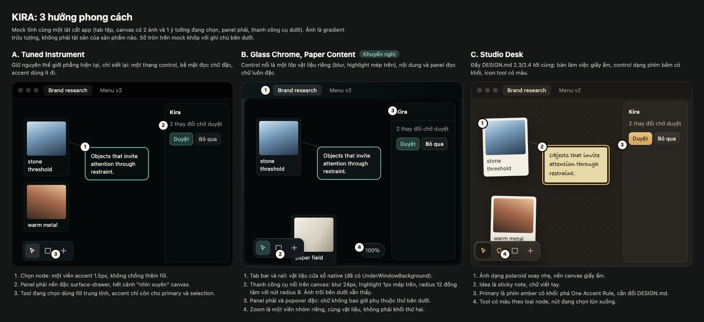
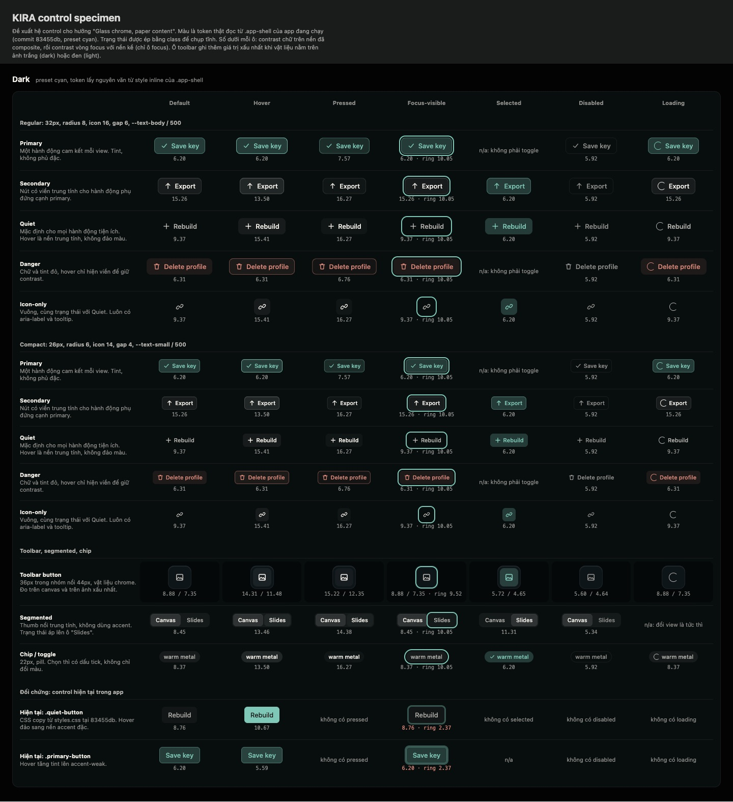

# Art direction: KIRA hôm nay và phong cách canvas app desktop 2026

- **Câu hỏi:** (A) KIRA hiện trông thế nào dưới mắt một art director, chỗ nào kéo nó xuống. (B) Một canvas app macOS "hạng nhất" năm 2026 trông ra sao, và KIRA nên đi hướng nào, bắt đầu từ hệ nút.
- **Người yêu cầu:** Orchestrator, giao cho thread Art Director (2026-09-14). Quyết định cuối thuộc user.
- **Commit đã kiểm chứng:** `83455db` (worktree `agent-aafe3478d99f3712e`). Mọi ảnh chụp, số đo token và contrast đều trên commit này. Nguồn ngoài truy cập 2026-09-14.
- **Cách đo:** vite dev server của chính worktree (đã chứng minh bằng file probe chỉ có trong worktree, sau đó xoá), Chrome headless 1440x900 điều khiển qua CDP bằng script Node stdlib. Không có Tauri runtime (xem §Giới hạn).
- **Nhãn nguồn:** **[đo]** đo trên app đang chạy, **[code]** đọc code tại `83455db`, **[ngoài]** nguồn ngoài có ngày, **[ngoài-phụ]** nguồn thứ cấp, **[suy luận]**.

Sản phẩm kèm theo:
- Ảnh hiện trạng: [`art-direction/current/`](art-direction/current/) (11 ảnh toàn màn hình, 7 ảnh cắt chi tiết).
- Mock 3 hướng: [`art-direction/directions.html`](art-direction/directions.html), ảnh [`directions.jpg`](art-direction/directions.jpg).
- Specimen hệ control: [`art-direction/controls.html`](art-direction/controls.html), ảnh [`controls-dark.jpg`](art-direction/controls-dark.jpg), [`controls-light.jpg`](art-direction/controls-light.jpg).
- Snapshot impeccable: `.impeccable/critique/2026-09-14T15-26-31Z__apps-desktop-src-main-tsx.md`.
- Tổng dung lượng ảnh commit: **2.268 KB** (21 file JPEG).

---

## Kết luận ngắn

1. **Nội dung đẹp, chrome kéo xuống.** Canvas (node ảnh có dải palette, quan hệ có kiểu, nền chấm) và hero onboarding có chủ đích rõ. Thứ làm app trông "AI lắp ghép" là lớp control: 5 font-weight và 17 chiều cao khác nhau trên phần tử `<button>`, hover của nút quiet đảo sang nền accent đặc trong khi nút primary chỉ tăng tint, và một nhóm nút trong popover chi tiết node còn nền xám mặc định của trình duyệt. **impeccable: 24/40** (Acceptable).
2. **Bề mặt đọc chữ đang "trong suốt mà không có vật liệu".** Thư viện (alpha 0.74 dark, 0.78 light) và popover (0.94) không có blur, nên node canvas hiện xuyên qua danh sách. Đây là lỗi thẩm mỹ lớn nhất và nó có thật cả trong app native, vì đây là DOM chồng DOM.
3. **Vòng focus hiện tại không đạt 3:1:** đo được **2,37:1** (dark) và **1,76:1** (light) trên `--surface-1`.
4. **Canvas app 2026 tách hai lớp:** control là một lớp vật liệu nổi, nội dung và panel đọc chữ thì đặc (Apple macOS 26, Figma UI3, Linear 2025-2026). Khuyến nghị hướng **B "Glass Chrome, Paper Content"**, làm theo thứ tự: hệ control và bề mặt đặc trước (không cần glass), vật liệu sau.
5. **Hệ control đề xuất đã dựng bằng token thật** và đo: 172 ô trạng thái, chữ thấp nhất **5,34:1** (dark) và **4,68:1** (light), vòng focus thấp nhất **9,52:1** và **5,48:1**, nút toolbar trên ảnh xấu nhất thấp nhất **4,64:1**. Làm Đợt 1 và 2 (khoảng 1,5 ngày) **trước** panel phải để panel sinh ra đã dùng hệ mới.

---

## A. Audit thẩm mỹ hiện trạng

### A.0 Ảnh đã chụp và trạng thái đạt được

| # | Ảnh | Trạng thái | Cách đạt |
|---|---|---|---|
| 01 | [onboarding-dark](art-direction/current/01-onboarding-dark.jpg) | Onboarding lần đầu | `localStorage.clear()` |
| 02 | [canvas-dark](art-direction/current/02-canvas-dark.jpg) | Canvas seed, 9 node | `__kiraDev.resetSeed()`, đóng Thư viện |
| 03 | [node-selected-dark](art-direction/current/03-node-selected-dark.jpg) | Chọn 1 idea node | click |
| 04 | [node-details-dark](art-direction/current/04-node-details-dark.jpg) | Popover chi tiết node | double-click |
| 05 | [kira-dock-dark](art-direction/current/05-kira-dock-dark.jpg) | Dock Kira mở, có context | nút "Ask Kira" |
| 06 | [library-120-list-hover-dark](art-direction/current/06-library-120-list-hover-dark.jpg) | Thư viện 120 reference, hover nút "Import image" | `__kiraDev.loadFixture()` |
| 07 | [settings-ai-providers-dark](art-direction/current/07-settings-ai-providers-dark.jpg) | Settings, AI Providers | "Open Settings" |
| 08 | [slides-dark](art-direction/current/08-slides-dark.jpg) | Slides | view switcher |
| 09 | [outline-dark](art-direction/current/09-outline-dark.jpg) | Outline | view switcher |
| 10 | [library-canvas-light](art-direction/current/10-library-canvas-light.jpg) | Light, Thư viện mở trên canvas | `appearance.colorMode='light'`, `canvasColor='#eceeee'` |
| 11 | [settings-ai-providers-light](art-direction/current/11-settings-ai-providers-light.jpg) | Light, Settings | như trên |

Fixture 120 reference xếp các node ảnh chồng lên nhau và che hết idea node, nên không đại diện cho canvas thật. Tôi dùng fixture cho Thư viện và dùng seed cho canvas. **Chưa chụp:** 3D view và dock khi có model đã kết nối (browser không có provider).

### A.1 Điểm impeccable (Operate mode)

> ⚠️ Chạy **single-context**: critique chạy bên trong một agent đã được giao việc; tôi không mở thêm 2 sub-agent vì user không yêu cầu. Assessment A được ghi ra file trước khi đọc kết quả detector.

| # | Heuristic | Điểm | Vấn đề chính |
|---|---|---|---|
| 1 | Visibility of system status | 3 | Tốt: "Ready", "key missing", "9/9", chấm chưa lưu, dock báo chưa kết nối model |
| 2 | Match system / real world | 3 | Lọt từ kỹ thuật: "Downstream branch", "~177 tokens", "1 refs" |
| 3 | User control | 3 | Esc và nút đóng có ở mọi overlay đã thử; có undo |
| 4 | Consistency | 2 | Ba "phương ngữ" hover; 5 weight; nút xám mặc định trình duyệt |
| 5 | Error prevention | 2 | "Delete profile" nằm cùng hàng, cùng chiều cao với "Save key" |
| 6 | Recognition over recall | 2 | Rail và tool rail chỉ có icon, phím tắt chỉ trong tooltip |
| 7 | Flexibility | 3 | Có phím tắt, Arrange, nhiều đường thao tác |
| 8 | Aesthetic & minimalist | 2 | Panel trong suốt không blur; 4 cụm nổi rời nhau ở mép dưới |
| 9 | Error recovery | 2 | Ít đường phục hồi ngoài link "Open AI settings" |
| 10 | Help | 2 | Onboarding và tooltip |
| | **Tổng** | **24/40** | Acceptable |

Xu hướng cùng slug: 28 (06-29), 30 (09-12), 25 (09-12), **24** (hôm nay). Các lượt dùng phương pháp khác nhau nên không so như nhau được.

**Detector [đo]:** `impeccable detect` trên `apps/desktop/src` trả **75 finding**: 3 warning (`--ease-spring` có overshoot ở `styles.css:136`, font "Bradley Hand" chưa khai trong DESIGN.md, `broken-image` ở `main.tsx:12367` là **false positive** vì trúng một comment) và 72 advisory (46 màu, 14 radius, 12 font-size ngoài DESIGN.md). Quét trong trang ở 5 trạng thái: chữ 11px (false positive, là bậc `--text-small` đã duyệt), spring curve, `transition: width` của dock, một chỗ viền 1px cộng bóng 36px. **Detector không bắt được** 4 vấn đề lớn nhất bên dưới.

### A.2 Phát hiện, xếp theo mức ảnh hưởng tới người dùng mục tiêu

Người dùng là art director và brand strategist: họ **đánh giá màu và hình ảnh cả ngày**. Với họ, chrome làm bẩn hình ảnh hay làm lệch cảm nhận màu là lỗi nặng hơn một nhãn lệch 1px.

#### P1-1. Bề mặt đọc chữ trong suốt mà không có vật liệu
- **Ảnh:** [crop-c](art-direction/current/crop-c-library-see-through-light.jpg), [06](art-direction/current/06-library-120-list-hover-dark.jpg), [04](art-direction/current/04-node-details-dark.jpg).
- **Sự thật [đo][code]:** `.inbox` dùng `background: var(--glass-drawer)` (`styles.css:1609`), token này là `rgb(6 12 12 / 0.74)` ở dark và `rgb(218 225 225 / 0.78)` ở light (`DRAWER_GLASS_ALPHA`, `main.tsx:12876`). Popover chi tiết node là `rgba(22, 29, 32, 0.94)`. `backdrop-filter`: 0 lần trong `styles.css`. Ở light, node "stone threshold" và "brushed altar object" hiện rõ xuyên qua danh sách Thư viện.
- **Vì sao quan trọng:** hai reference chồng lên nhau đúng lúc người dùng đang chọn một reference. Trong suốt không blur không đọc thành "kính", nó đọc thành "lỗi render". Đây cũng là dấu hiệu glassmorphism-trang-trí mà PRODUCT.md cấm.
- **Ghi chú:** alpha này được chọn để vật liệu cửa sổ native lộ ra, nhưng Thư viện nằm **trên canvas** (DOM), không nằm trên vật liệu, nên hiện tượng giống hệt trong app native [suy luận từ code, chưa chụp app native].

#### P1-2. Vòng focus dưới 3:1
- **Sự thật [đo]:** `--focus-ring: 0 0 0 3px color-mix(in srgb, var(--accent-cyan), transparent 62%)` (`styles.css:141, 345`). Đo trong specimen bằng token thật: **2,37:1** (dark) và **1,76:1** (light) giữa màu vòng đã composite và `--surface-1`. Hàng "Đối chứng" cuối [controls-dark](art-direction/controls-dark.jpg) và [controls-light](art-direction/controls-light.jpg).
- **Vì sao:** người dùng bàn phím không thấy mình đang ở đâu, nhất là ở light.

#### P1-3. Hệ control có nhiều phương ngữ
- **Ảnh:** [crop-d](art-direction/current/crop-d-icon-hover-inversion.jpg), [crop-a](art-direction/current/crop-a-details-actionbar.jpg), [crop-e](art-direction/current/crop-e-settings-hierarchy.jpg).
- **Sự thật [đo][code]:**
  - `.icon-button:hover, .quiet-button:hover { background: var(--accent-strong); color: var(--bg-base) }` (`styles.css:1099-1103`): hover đảo sang khối teal đặc. `.primary-button:hover` chỉ tăng tint (`1109-1112`). `.canvas-tool-rail button:hover` là trắng 5% (`5074-5077`). Ba cách nói "đang hover".
  - Đo `<button>` hiển thị trên 6 trạng thái (canvas có Thư viện, Settings Providers, Settings General, Outline, Slides, dock): **17 chiều cao khác nhau** (16 giá trị từ 14 đến 56px, cộng hero slide 520px), **5 radius** (0, 4, 6, 8, 10px), **5 font-weight** (400, 500, 550, 620, 700). DESIGN.md chỉ cho 400/680/800.
  - Một hàng trong Settings: "Save key" 13px/500, "Test" 13px/400, "Delete profile" 11px/400.
  - `.node-details-actionbar button` (`styles.css:3998-4006`) không reset `background`: Chrome vẽ nền `rgb(107, 107, 107)` (ButtonFace). WebKit có ButtonFace riêng, chưa kiểm trong app native.
  - Hai bộ icon gặp nhau ngay ở mép dưới canvas: tool rail dùng phosphor, cụm zoom dùng lucide ([crop-f](art-direction/current/crop-f-bottom-chrome.jpg)). Import: khoảng 59 icon lucide, 14 icon phosphor (`main.tsx:15-91`).
- **Vì sao:** nhất quán là thứ làm product UI trông "đắt". Hover đảo màu đặc là nhịp to nhất trên màn hình, và nó xảy ra với nút *ít quan trọng nhất*.

#### P1-4. Toolbar của Outline và Slides đè lên view switcher
- **Ảnh:** [crop-b](art-direction/current/crop-b-outline-toolbar-collision.jpg), [08](art-direction/current/08-slides-dark.jpg).
- **Sự thật [đo]:** ở 1440x900, segmented "All/Strong/Needs work" đè nút "Outline" **12x15px**; nút "HTML" đè nút "Open project settings" **22x21px**. Nút Outline có weight 700, khác 400 ở canvas. Ở Slides, cụm điều khiển trình chiếu nằm dưới cùng nút cài đặt project.

#### P2-5. Phân cấp chữ trong Settings bị ngược
- **Ảnh:** [07](art-direction/current/07-settings-ai-providers-dark.jpg), [crop-e](art-direction/current/crop-e-settings-hierarchy.jpg).
- **Sự thật [đo]:** h3 "More providers" và "Routing preview" 15px/680, trong khi tên provider đang chọn "OpenAI Platform" 11px/700. Tiêu đề phụ to hơn đối tượng đang sửa. 8 ô checkbox dạng chip có viền trông như 8 nút. Toast "Extension status refreshed" chiếm đúng chỗ của một nút ở header.

#### P2-6. Light mode xám đục, mất phân tầng
- **Ảnh:** [10](art-direction/current/10-library-canvas-light.jpg), [11](art-direction/current/11-settings-ai-providers-light.jpg).
- **Sự thật [đo]:** `--bg-canvas #dfe5e5`, `--surface-1 #d7dede`, `--surface-2 #cad3d5`, `--bg-base #eff3f3`: toàn bộ chrome nằm trong một dải sáng hẹp, ngả xanh. Nút Kira ở mép dưới gần như biến mất. Scrim `rgb(35 33 29 / 0.38)` làm nền sau Settings chỉ xỉn nhẹ.
- **Vì sao với art director [suy luận]:** nền bao quanh có tint làm lệch cảm nhận màu của ảnh (lý do phòng xem ảnh chuẩn dùng xám trung tính). Surface dark cũng ngả teal (`#080e0e`), trong khi chữ lại ấm (`#f4f1ea`): trộn xám nóng và xám lạnh.

#### P2-7. Accent dùng quá nhiều chỗ
- **Sự thật [đo]:** canvas seed, chọn 1 node: **29 phần tử hiển thị** mang màu accent (color, nền, viền, bóng hoặc stroke), chưa tính 23 path SVG con. Gồm thumb của view switcher, nút tool đang chọn, viền node chọn, tay nắm, cạnh quan hệ, chấm trạng thái, icon link trên cạnh, nút Ask Kira.
- **Vì sao:** One Accent Rule giữ đúng *một màu* nhưng không giới hạn *số chỗ*. Khi mọi thứ đều teal, teal không còn nghĩa "đây là thứ đang active".

#### P2-8. Dock mở có hai viền accent lồng nhau
- **Ảnh:** [crop-g](art-direction/current/crop-g-dock-double-outline.jpg). Viền container accent cộng viền ô nhập đang focus accent. Dock cũng đè lên thanh công cụ dưới.

#### P3-9. Motion có nảy
- **Sự thật [code]:** `--ease-spring: cubic-bezier(0.32, 1.28, 0.42, 1)` dùng 7 lần, gồm thumb segmented và `width`, `border-radius`, `transform` của dock (`styles.css:742, 4267-4286`). DESIGN.md §6 viết "no bounce". Animate `width` còn là layout thrash.

#### P3-10. DESIGN.md không còn khớp màu đang render
- **Sự thật [đo]:** front matter ghi `bg-base #0d0e0d`, `accent-strong #9edccd`; app render `--bg-base #020303`, `--accent-strong #7fc8b7` (bằng `--accent-cyan`). `#020303` gần như đen tuyệt đối (design-taste-frontend cấm pure black).

### A.3 Điều đang làm tốt (giữ lại)

- **Canvas là tài sản thật.** Node ảnh có dải palette dưới chân, idea node có chấm trạng thái, quan hệ có kiểu, nền chấm yên. Nội dung chiếm ưu thế ([02](art-direction/current/02-canvas-dark.jpg)).
- **Hero onboarding** ("Start calm. Add power later.") là khoảnh khắc thương hiệu tốt nhất: một chữ lớn, một nút primary, không wizard ([01](art-direction/current/01-onboarding-dark.jpg)).
- **Kỹ thuật contrast đã có nền móng.** `projectColorTokens()` tự kéo `--text-soft` lên 7:1 và `--text-muted` lên 4,6:1 trên mọi bề mặt đọc (`main.tsx:12855-12922`). Mọi chữ control đo trong specimen, kể cả control hiện tại, đều từ 5,48:1 trở lên. Vấn đề là *hình thái*, không phải *màu chữ*.
- **Slide bìa** có giọng editorial đúng người dùng ([08](art-direction/current/08-slides-dark.jpg)).

### A.4 Nhìn qua lăng kính design-taste-frontend (3/3/6)

| Luật (đã chỉnh núm) | KIRA hiện tại | Kết luận |
|---|---|---|
| Motion 3: chỉ `:hover`, `:active`, không animation tự chạy | Không có `:active` nhấn trên nút; có spring nảy | Thêm nhấn `scale(0.98)`, bỏ spring |
| Density 6: app thường ngày | Mép dưới 4 cụm nổi rời (Edit/Discover/Arrange, 7 tool, dock, zoom) | Gộp nhóm, cùng vật liệu |
| Không pure black, không trộn xám nóng lạnh | `#020303` và surface ngả teal dưới chữ ấm | Cân lại neutral (quyết định riêng, không nằm trong hệ nút) |
| Glass: viền trong 1px, highlight trong | Có `--shell-shadow` inset nhưng không có blur | Dùng đúng chỗ ở hướng B |
| Tailwind, Framer Motion, font Geist | Không áp dụng | DESIGN.md và stack hiện tại thắng |

---

## B. Phong cách canvas app desktop 2025-2026

### B.1 Khảo sát, tách sự thật và suy luận

| Sản phẩm | Sự thật (nguồn, ngày) | Rút ra cho KIRA [suy luận] |
|---|---|---|
| **Apple macOS 26 Tahoe** | Control làm bằng Liquid Glass và được mô tả là một lớp chức năng riêng nằm trên app ([Apple Newsroom, 2025-06-09](https://www.apple.com/newsroom/2025/06/apple-introduces-a-delightful-and-elegant-new-software-design/)). Thêm cỡ extra-large; mini, small, medium cao hơn; large và XL thành capsule, cỡ nhỏ vẫn là rounded rect; toolbar item tự gom lên nền glass; bỏ glass khỏi item không tương tác; tint "prominent"; glass cho custom view chỉ dành cho control quan trọng; glass không lấy mẫu glass ([WWDC25 session 310](https://developer.apple.com/videos/play/wwdc2025/310/)). | Chrome và content là hai lớp. Cỡ nút lớn hơn trước. Nhóm nút chung một nền. Không chồng glass lên glass. |
| Apple, phản hồi thực tế | Toolbar nhiều app chỉ còn là những hình oval xám phẳng, áp dụng không đồng đều, có lúc khó đọc ([Six Colors, 2025-09-15](https://sixcolors.com/post/2025/09/macos-26-tahoe-review-power-under-glass/)). macOS 26.1 thêm lựa chọn Clear và Tinted; Reduce Transparency tắt hẳn glass; Increase Contrast thêm viền ([Eclectic Light, 2025-11-05](https://eclecticlight.co/2025/11/05/appearance-revisited-get-tahoe-26-1-looking-in-better-shape/)). | Glass phải có đường lui đặc. Chữ trên glass phải đo trên nền xấu nhất. |
| Apple HIG (Buttons) | **Không đọc được**: trang nạp bằng JS, WebFetch chỉ lấy được tiêu đề. Nội dung về control ở trên lấy từ transcript WWDC và nguồn phụ. | Cần đọc lại HIG bằng trình duyệt trước khi ghi vào DESIGN.md. |
| **Figma UI3** | Toolbar mảnh dời xuống đáy canvas; panel resize được; icon vẽ tay mới; input có nền, dropdown có viền ([Figma blog, 2024-06-26](https://www.figma.com/blog/behind-our-redesign-ui3/)). Panel nổi bị **rút lại** thành cố định vì làm chật canvas và làm chậm người dùng lâu năm; toolbar đáy vẫn nổi ở mọi sản phẩm; FigJam giữ panel nổi mặc định; bỏ hướng chỉ-icon vì a11y ([Figma blog, Our approach to designing UI3](https://www.figma.com/blog/our-approach-to-designing-ui3/)). | Toolbar tạo nội dung nổi ở đáy là chuẩn. Panel đọc và sửa nhiều nên đặc, ổn định. |
| **FigJam** | Panel nổi là mặc định (cùng nguồn Figma trên). | Công cụ brainstorm chấp nhận chrome nổi hơn công cụ thiết kế chi tiết. |
| **tldraw** v4.0 | Style panel thiết kế lại, toolbar hỗ trợ dọc, đạt WCAG 2.2 AA ([tldraw docs, release v4.0.0](https://tldraw.dev/releases/v4.0.0), trang không ghi ngày). | Canvas SDK phổ biến coi a11y là chuẩn tối thiểu. |
| **Apple Freeform** | macOS 26.4 (2026-03-24) cập nhật Freeform với công cụ ảnh ([The Apple Post](https://www.theapplepost.com/2026/03/24/70217/macos-26-4-released-with-new-emoji-safari-updates-and-freeform-improvements/)) [ngoài-phụ]. Chưa kiểm chi tiết giao diện. | Tham chiếu gần nhất cho "canvas theo ngôn ngữ hệ thống", nhưng chưa có dữ liệu cụ thể. |
| **Miro** | Công cụ chính dồn về trái header; Formats và Focus Modes để chuyển giữa canvas và toàn màn hình ([Miro blog, tháng 6/2025](https://miro.com/blog/what-we-launched-june-2025/)). | Chuyển view là chuyển ngữ cảnh, cần một chỗ ổn định (KIRA đang để toolbar view đè lên switcher). |
| **Heptabase** | Toolbar whiteboard mới, tooltip hiện phím tắt; sidebar phải thiết kế lại để mở Chat, Card Library, Journal ở mọi nơi ([Heptabase, 2025-09-12](https://wiki.heptabase.com/newsletters/2025-09-12)). Không có số liệu thị giác. | Mô hình panel phải đa năng giống quyết định panel phải của KIRA. |
| **Kosmik** | Canvas vô hạn có trình duyệt Chromium nhúng để kéo ảnh vào ([TechCrunch, 2023-12-21](https://techcrunch.com/2023/12/21/meet-kosmik-a-visual-canvas-with-an-in-built-pdf-reader-and-a-web-browser)); nguồn 2025-2026 chủ yếu là blog tự quảng bá. | Đối thủ trực tiếp về capture. Không đủ dữ liệu giao diện để trích. |
| **Muse** | Muse 3.0 (2023-09-27): sidebar thu gọn, thanh điều hướng breadcrumb, toolbar mới ([Muse memo](https://museapp.com/memos/2023-09-muse-3-collaboration/)). App Store hiện hiển thị tên "Allume" cho cùng app id [ngoài-phụ, chưa xác minh]. | Minimal chrome là gốc triết lý DESIGN.md §2.4. |
| **Milanote** | 3.18.1 (tháng 4/2025) được gọi là bản cập nhật lớn nhất, có sửa vị trí toolbar ([Milanote releases](https://milanote.com/releases)) [ngoài-phụ]. | Không có dữ liệu thị giác mới. |
| **Eagle 4** | Giao diện dùng nhiều trong suốt và frosted glass, icon vẽ lại, có tuỳ chọn mật độ ([Eagle blog](https://en.eagle.cool/blog/post/eagle4)). | Công cụ quản lý reference cùng người dùng đã đi hướng glass. |
| **Are.na** | Chỉ có review App Store nhắc một đợt UI mới cuối 2025 [ngoài-phụ, chưa xác minh]. | Bỏ qua. |
| **Linear** | Liquid Glass trên mobile: blur, gradient, specular highlight bằng shader, **cố ý bỏ khúc xạ** vì hại khả năng đọc trong giao diện dày; high-contrast thì thêm viền đặc ([Linear, 2025-10-21](https://linear.app/now/linear-liquid-glass)). Refresh 2026: sidebar tối đi để nội dung nổi, icon ít và nhỏ hơn, đường chia mềm hơn, xám chuyển sang ấm; nguyên tắc "Don't compete for attention you haven't earned" ([Linear, 2026-03-12](https://linear.app/now/behind-the-latest-design-refresh)). | Chrome lùi, nội dung tiến. Glass không khúc xạ. Xám ấm. |
| **Raycast** v2 | Thiết kế lại cho Liquid Glass, thêm chế độ cửa sổ compact ([Raycast manual](https://manual.raycast.com/new-in-v2), không ghi ngày). | Mật độ do người dùng chọn. |
| **Things** 3.22 | Chút glass ở sidebar, phần lớn thành phần vẫn đặc, khoảng cách rộng hơn, chỉnh độ cong cửa sổ và control, nút phản hồi bằng scale ([Cultured Code, 2025-09](https://culturedcode.com/things/blog/2025/09/things-for-os-26/)). | Glass liều thấp, đặt ở điều hướng. |
| **Craft** | Cập nhật Liquid Glass trên iPhone, iPad, Mac ([9to5Mac, 2025-09-23](https://9to5mac.com/2025/09/23/craft-ipad-liquid-glass-foundation-models/)) [ngoài-phụ]. | App tài liệu cao cấp đã theo hệ thống. |
| **Dia** (thay Arc) | GA trên macOS 2025-10-08, AI ở sidebar ([Sigma Browser blog](https://www.sigmabrowser.com/blog/dia-vs-arc-browser-in-2026-ai-workspaces-switching)) [ngoài-phụ]. | AI nằm cạnh nội dung, giống panel phải của KIRA. |

### B.2 Mẫu hình định nghĩa "canvas app desktop 2026"

1. **Chrome và content là hai lớp vật liệu khác nhau.** Control nổi trên một vật liệu (Apple, Linear, Eagle, Things); nội dung và panel đọc nhiều thì đặc (Figma rút panel nổi, Things giữ thành phần đặc).
2. **Toolbar tạo nội dung nổi ở đáy canvas, gom thành một nhóm** (Figma, FigJam, tldraw, KIRA đã có). Item không tương tác không có nền (Apple).
3. **Vật liệu có đường lui đặc** và phải đọc được trên nền xấu nhất (macOS 26.1 Tinted, Reduce Transparency; Linear bỏ khúc xạ).
4. **Control to hơn, góc đồng tâm.** macOS 26 tăng chiều cao mini/small/medium, bo góc cửa sổ lớn hơn và yêu cầu control né góc.
5. **Primary không la hét.** Primary thể hiện bằng *tint prominence* hoặc là nút mặc định phím Return, không bằng khối màu to ở mọi nơi. Secondary có tint yếu hơn (Apple `tintProminence .secondary`).
6. **Selection và focus giữ accent; hover thì trung tính.** [suy luận từ Linear và hệ thống macOS]
7. **Một bộ icon, ít và nhỏ hơn** (Figma vẽ lại toàn bộ; Linear giảm số lượng và kích thước).
8. **Xám ấm, chrome lùi về sau** (Linear 2026: sidebar tối đi, xám ấm).
9. **Dark và light ngang nhau.** Glass tự thích nghi độ sáng; light mode của các app trên có chrome sáng rõ ràng, không xám đục. [suy luận]

### B.3 Ba hướng cho KIRA

Mock: [directions.jpg](art-direction/directions.jpg) (nguồn [directions.html](art-direction/directions.html)).

#### A. Tuned Instrument
- **Luận đề:** giữ thế giới phẳng hiện tại, chỉ siết lại một thang control, bề mặt đọc đặc, accent dùng ít đi.
- **Đổi:** hệ control 7 trạng thái; Thư viện và popover đặc; hover trung tính; view switcher và tool đang chọn dùng fill trung tính; bỏ spring.
- **Giữ:** mọi token màu, không blur, bố cục.
- **Rủi ro với DESIGN.md:** gần như không. Rủi ro sản phẩm: sạch hơn nhưng chưa "2026", vẫn thiếu chiều sâu mà §2.3 mong.
- **Mượn:** Linear 2026 (chrome lùi), Figma UI3 (panel đặc), Things (thành phần đặc).

#### B. Glass Chrome, Paper Content *(khuyến nghị)*
- **Luận đề:** control nổi là một lớp vật liệu riêng (blur, highlight mép trên, bo đồng tâm), còn nội dung và mọi panel có chữ để đọc thì đặc.
- **Đổi:** toàn bộ của A, cộng: tab bar và rail dùng vật liệu cửa sổ native đã có (`UnderWindowBackground`); tool rail, cụm zoom, view switcher, cụm Edit/Discover và dock khi đóng dùng `--material-toolbar` + `backdrop-filter: blur(24px) saturate(1.4)`; nhóm nút radius 12 chứa nút radius 8 (đồng tâm với padding 4); nút toolbar 36px.
- **Giữ:** One Accent Rule, primary dạng tint, token chữ, panel phải là bề mặt đặc (khớp quyết định panel phải).
- **Rủi ro với DESIGN.md:** PRODUCT.md và DESIGN.md cấm "glassmorphism as decoration". Cần viết thành ngoại lệ có luật như báo cáo `2026-09-14-design-quality-skills-oss.md` §3.3 (chỉ chrome nổi, tối đa một lớp, đo trên nền xấu nhất, có công tắc giảm trong suốt). Rủi ro kỹ thuật: `backdrop-filter` trên WKWebView phía trên canvas nhiều node có thể tụt khung hình, **chưa đo**. Để đạt 4,5:1 cả khi dưới là ảnh trắng, vật liệu dark phải đục tới alpha 0,93 (§B.5), nên hiệu ứng "nhìn xuyên" rất nhẹ: đây là đánh đổi có chủ đích.
- **Mượn:** Apple macOS 26 (lớp control, nhóm nút, đồng tâm), Linear (glass không khúc xạ, chrome lùi), Figma UI3 (toolbar nổi, panel đặc), Eagle 4 (glass trong công cụ reference).

#### C. Studio Desk
- **Luận đề:** đẩy DESIGN.md §2.3 và §2.4 tới cùng: bàn làm việc giấy ấm, ảnh dạng polaroid, idea là sticky note, control dạng phím có khối, icon tool có màu.
- **Đổi:** neutral chuyển sang nâu giấy ấm; primary thành phím amber; nút có gradient và bóng; tool có màu theo loại node.
- **Giữ:** bố cục, luồng.
- **Rủi ro với DESIGN.md:** phá One Accent Rule (primary amber), nguy cơ trượt về skeuomorphism nặng; nền ấm cũng làm lệch cảm nhận màu ảnh, đúng điều art director cần tránh; công lớn nhất.
- **Mượn:** Milanote và Muse (giấy, ghi chú), Things (control phản hồi xúc giác), Raycast (phím có khối).

#### Khuyến nghị
**Chọn B, nhưng làm theo thứ tự của A.** Đợt 1 và 2 (hệ control, bề mặt đặc, focus) đều đúng cho cả A lẫn B và không cần glass. Vật liệu (Đợt 4) chỉ bật sau khi đo FPS trên bundle thật. Nếu FPS không đạt, dừng ở A mà không phải làm lại gì.

### B.4 Đặc tả hệ control (hướng B), nút trước

Specimen dựng bằng **token thật** đọc từ style inline của `.app-shell` trong app đang chạy (preset cyan, dark và light), trạng thái ép bằng class để chụp tĩnh. Số dưới mỗi ô là contrast đo trong trang.

Ảnh light: [controls-light.jpg](art-direction/controls-light.jpg).

#### Kích thước

| Cỡ | Chiều cao | Padding ngang | Radius | Icon | Gap | Chữ |
|---|---|---|---|---|---|---|
| Compact | 26px `--control-h-sm` | 7px + viền 1px | 6px `--radius-2` | 14px | 4px | `--text-small` 11px / 500 |
| Regular | 32px `--control-h-md` | 11px + viền 1px | 8px `--radius-3` | 16px | 6px | `--text-body` 13px / 500 |
| Toolbar | 36px `--control-h-lg` (mới), trong nhóm 44px padding 4 | 0 (vuông) | nút 8px, nhóm 12px `--radius-4` | 18px | nhóm gap 2px | không có chữ |
| Chip | 22px `--control-h-xs` (mới) | 8px | 999px | 12px | 4px | `--text-small` / 500 |
| Segmented | track 28px (option 24px, padding 2) | 10px | track 8px, thumb 6px | tuỳ | 2px | `--text-small` / 500 |

Quy tắc dùng cỡ: Regular cho dialog, Settings, onboarding; Compact cho panel, Thư viện, dock, popover node. Viền 1px luôn có (trong suốt khi không dùng) để đổi trạng thái không làm nhảy layout.

#### Biến thể và trạng thái

Ký hiệu: `A%` = `color-mix(in srgb, var(--accent-cyan) A%, transparent)`.

| Biến thể | Default | Hover | Pressed | Focus-visible | Selected | Disabled | Loading |
|---|---|---|---|---|---|---|---|
| **Primary** | nền `--glass-active`, viền accent 38%, chữ `--accent-on-glass-active` | viền accent 80%, highlight trong; **fill giữ nguyên** | nền `--glass-active-pressed` (16%), `scale(0.98)` | default + `outline: 2px solid var(--accent-cyan); outline-offset: 2px` | n/a (không phải toggle) | nền trong suốt, viền `--border-soft`, chữ `--text-muted` | giữ nền, spinner thay icon, `aria-busy`, giữ nguyên bề rộng |
| **Secondary** | nền `--control-fill`, viền `--control-border`, chữ `--text-main`, highlight trong | `--control-fill-hover`, `--control-border-hover` | `--control-fill-pressed`, bỏ highlight, scale | như trên | nền `--glass-active`, viền accent 38%, chữ `--accent-on-glass-active` | trong suốt, `--border-soft`, `--text-muted` | như trên |
| **Quiet** | trong suốt, chữ `--text-soft` | `--glass-hover`, chữ `--text-main` (**không đảo màu**) | `--control-fill-pressed`, scale | như trên | `--glass-active`, `--accent-on-glass-active` | `--text-muted` | như trên |
| **Danger** | nền danger 10%, chữ `--danger` | thêm viền danger 45%, **fill giữ nguyên** | nền danger 5%, viền 45% | như trên | n/a | trong suốt, `--text-muted` | như trên |
| **Icon-only** | như Quiet, vuông 26 hoặc 32 | như Quiet | như Quiet | như trên | như Quiet | như Quiet | spinner |
| **Toolbar** | trên `--material-toolbar`, icon `--text-soft` | `--glass-hover`, `--text-main` | `--control-fill-pressed`, scale | như trên | `--glass-active`, `--accent-on-glass-active` | `--text-muted` | spinner |
| **Segmented** | track `--seg-track`; option `--text-soft` | option `--glass-hover`, `--text-main` | `--control-fill-pressed` | outline trên option | thumb `--seg-thumb` trung tính + highlight, chữ `--text-main` (**không accent**) | `--text-muted` | n/a (đổi view tức thì) |
| **Chip / toggle** | `--glass-hover`, `--text-soft` | `--control-fill-hover`, `--text-main` | `--control-fill-pressed` | như trên | `--glass-active`, `--accent-on-glass-active`, **có dấu tick** | trong suốt, viền `--border-soft`, `--text-muted` | spinner thay tick |

Chuyển động: `background`, `border-color`, `color` 120ms `--ease-soft`; `transform` 120ms `--ease-out-soft`. Không spring. `prefers-reduced-motion`: bỏ scale.

Vì sao hover của primary và danger chỉ đổi viền: tăng tint làm nền tiến gần màu chữ, contrast giảm khi hover (repo đã gặp với danger: 4,68 ở 10% xuống 4,27 ở 16%, `styles.css:8138-8141`). Pressed thì *giảm* tint, nên contrast chỉ tăng ở cả hai mode.

#### Token

Dùng lại: `--control-h-sm`, `--control-h-md`, `--radius-2/3/4`, `--text-small`, `--text-body`, `--glass-hover`, `--glass-active`, `--accent-on-glass-active`, `--accent-cyan`, `--text-main/soft/muted`, `--border-soft`, `--danger`, `--shell-shadow`, `--panel-shadow`, `--duration-fast`, `--ease-soft`, `--ease-out-soft`.

**Token mới** (khai ở `.app-shell` hoặc trong `buildProjectAppearanceStyle()` cho các giá trị đổi theo mode, theo luật alias ở CLAUDE.md):

| Token | Dark | Light | Ghi chú |
|---|---|---|---|
| `--control-h-xs` | 22px | 22px | chip |
| `--control-h-lg` | 36px | 36px | toolbar |
| `--control-weight` | 500 | 500 | cần thêm 500 vào DESIGN.md (đang ghi 400/680/800, dù primary đã dùng 500) |
| `--control-fill` | `rgb(255 255 255 / 0.06)` | `rgb(255 255 255 / 0.55)` | secondary |
| `--control-fill-hover` | `rgb(255 255 255 / 0.1)` | `rgb(255 255 255 / 0.85)` | |
| `--control-fill-pressed` | `rgb(255 255 255 / 0.03)` | `rgb(255 255 255 / 0.3)` | |
| `--control-border` | `rgb(255 255 255 / 0.1)` | `rgb(35 33 29 / 0.14)` | |
| `--control-border-hover` | `rgb(255 255 255 / 0.18)` | `rgb(35 33 29 / 0.24)` | |
| `--control-highlight` | `inset 0 1px 0 rgb(255 255 255 / 0.06)` | `0 1px 1px rgb(35 33 29 / 0.06)` | |
| `--glass-active-pressed` | accent 16% | accent 16% | |
| `--seg-track` | `rgb(255 255 255 / 0.05)` | `rgb(35 33 29 / 0.06)` | |
| `--seg-thumb` | `rgb(255 255 255 / 0.11)` | `rgb(255 255 255 / 0.92)` | |
| `--material-toolbar` | `rgb(15 22 25 / 0.93)` (surface-2) | `rgb(239 243 243 / 0.9)` (bg-base) | kèm `backdrop-filter`; nên tính từ token theo preset |
| `--focus-outline` | `2px solid var(--accent-cyan)` | như dark | thay `--focus-ring` |

Các giá trị light ở trên dùng màu chữ `rgb(35 33 29)` (= `--text-main` light của preset cyan). Khi code thật, dẫn xuất từ `tokens.textMain` như các token khác trong `buildProjectAppearanceStyle()` để đúng mọi preset.

### B.5 Contrast đã đo

Cách đo: trong trang specimen, composite nền của mọi tổ tiên (canvas 1x1, đọc pixel), composite màu chữ có alpha lên đó, rồi tính theo WCAG. Vòng focus: màu outline so với nền ngay quanh control. Ô toolbar đo thêm trường hợp vật liệu nằm trên ảnh trắng tuyệt đối (dark) hoặc đen tuyệt đối (light), bỏ qua tác dụng làm dịu của blur. Dữ liệu thô: 184 ô, trong đó 12 ô là 2 hàng đối chứng.

| | Dark | Light |
|---|---|---|
| Số ô hệ mới có chữ | 86 | 86 |
| Chữ thấp nhất | **5,34** (segmented, disabled) | **4,68** (danger, default) |
| Vòng focus thấp nhất (13 ô mỗi mode) | **9,52** (toolbar) | **5,48** |
| Toolbar trên ảnh xấu nhất, thấp nhất | **4,64** (disabled) | **5,14** (disabled) |
| Ô không đạt | 0 | 0 |
| **Đối chứng hiện tại**, chữ | 5,59 đến 10,67 | 5,48 đến 8,55 |
| **Đối chứng hiện tại**, vòng focus | **2,37 (không đạt)** | **1,76 (không đạt)** |

Mẫu đo hệ mới, Regular, dark: Primary 6,20 / 6,20 / 7,57 / 6,20 / n/a / 5,92 / 6,20; Quiet 9,37 / 15,41 / 16,27 / 9,37 / 6,20 / 5,92 / 9,37 (theo thứ tự 7 trạng thái). Light: Primary 5,72 / 5,72 / 6,22 / 5,72 / n/a / 5,25 / 5,72; Danger 4,68 / 4,68 / 5,00 / 4,68 / n/a / 5,25 / 4,68.

Lần đầu tôi đặt `--material-toolbar` dark alpha 0,80: ô selected trên ảnh trắng chỉ đạt **3,26**. Nâng lên 0,90 được 4,30, vẫn thiếu; 0,93 mới đạt. Đây là lý do con số 0,93 ở trên.

Chưa đo: chữ đè lên ảnh thật đã blur (backdrop-filter không đưa vào composite), và WebKit.

---

## C. Ánh xạ vào component thật và lộ trình

### C.1 Ánh xạ

| Đề xuất | Class hiện có (dùng trong `main.tsx` / quy tắc trong `styles.css`) | Việc | Công |
|---|---|---|---|
| Focus outline | `:focus-visible` (`styles.css:14-18`), `--focus-ring` (`141`, `345`), các rule tự vẽ vòng | Đổi fallback toàn cục sang outline 2px; rà rule tự vẽ | S |
| Quiet, Icon-only | `.quiet-button` (25 / 7), `.icon-button` (13 / 8); hover `1099-1103` | Hover trung tính, thêm `:active`, `:disabled`, `[aria-busy]`, `[aria-pressed]`, cỡ compact | S |
| Primary | `.primary-button` (7 / 8), `848-856`, `1109-1112` | Hover viền, pressed tint thấp, disabled, loading | S |
| Danger | `.danger-button` (3 / 3, `8124-8145`), `.danger-inline-button` (1 / 2, `5923-5941`) | Gộp thành một biến thể 2 cỡ | S |
| Secondary | chưa có; đang dùng `.quiet-button` cạnh primary | Thêm class mới | S |
| Nút trong popover node | `.node-details-actionbar button` (`3998-4006`), `.node-toolbar` | Reset nền, dùng Icon-only compact | S |
| Segmented | `Segmented` (`main.tsx:808`), `.segmented*` (`717-779`) | Thumb trung tính, bỏ spring, track 28px | S |
| Chip / toggle | `.active-filter-chip`, `.suggestion-chips button`, `.kira-dock-scope-chip`, checkbox chip trong Settings | Biến thể chip 22px có tick | M |
| Tag hiển thị | `.mini-tag-chip` (17px, 108 lần xuất hiện trên các trạng thái đo) | **Giữ nhỏ** như tag, không ép lên 22px; mở rộng vùng bấm bằng padding hoặc pseudo | S |
| Toolbar | `.canvas-tool-rail` (`5029-5078`), `.canvas-zoom*`, `.canvas-view-rail-trigger`, `.content-view-switch` | Nhóm 44px, nút 36px, cùng vật liệu; hover trung tính | M |
| Rail trái, tab tệp | `.sidebar-view-button`, `.secondary-rail-button`, `.file-tab` | Chiều cao và radius theo thang | S |
| Dock | `.kira-dock*` (`4251+`) | Bỏ animate `width`, bỏ viền accent lồng nhau, nút theo thang | M |
| Bề mặt đọc đặc | `.inbox` `--glass-drawer` (`1609`), `DRAWER_GLASS_ALPHA` và `POPOVER_SURFACE_ALPHA` (`main.tsx:12860-12876`) | Thư viện và popover dùng nền đặc | S (cần đo lại contrast chữ, token đã floor sẵn) |
| Vật liệu chrome | chưa có `backdrop-filter` | Token `--material-toolbar`, công tắc giảm trong suốt, đo FPS trên bundle | L |
| Va chạm Outline, Slides | toolbar view Outline, Slides và `.top-inspector-button` | Đưa toolbar view xuống hàng riêng dưới switcher hoặc về slot trái | M |
| Phân cấp Settings | h3 trong Settings, `.provider-task-group-label`, checkbox chip | Một cỡ chữ cho mỗi vai trò; checkbox thành list row | M |
| Icon | lucide (khoảng 59), phosphor (14) | Gộp một bộ | M |

S: dưới nửa ngày. M: 1-2 ngày. L: từ 3 ngày, cần app native.

### C.2 Thứ tự làm, không đá với panel phải MVP

Panel phải sắp dựng sẽ sinh ra nhiều nút mới (Nhận, Bỏ, tab Chat và Cần bạn, ô nhập). Nếu làm panel trước, các nút đó sẽ sinh ra theo phương ngữ cũ rồi phải sửa lại.

1. **Đợt 1, token và focus** (S, `styles.css` khối token + `buildProjectAppearanceStyle()`): thêm token mới dạng *cộng thêm*, đổi focus. Không đổi tên class, không đụng bố cục. Claim `styles.css` vùng `1-360` và `main.tsx` vùng `12781-12850`.
2. **Đợt 2, nút** (S-M): Quiet, Icon-only, Primary, Secondary, Danger, nút trong popover node. Claim `styles.css` `800-870`, `1095-1115`, `3995-4020`, `5920-5945`, `8120-8150`.
3. **Panel phải MVP** dùng ngay class của Đợt 2. Panel là bề mặt đặc trong cả hướng A và B, nên không phải làm lại khi bật vật liệu.
4. **Đợt 3, segmented, chip, bề mặt đặc** (M): song song với panel nếu claim vùng khác (`717-780`, `1600-1615`).
5. **Đợt 4, vật liệu chrome** (L): sau khi panel ship. Đo FPS trên bundle debug với fixture 120 reference trước và sau; có công tắc giảm trong suốt; cập nhật DESIGN.md với luật glass.
6. **Đợt 5, va chạm view toolbar, Settings, dock, icon** (M mỗi việc).

Mỗi đợt chạm `styles.css` hoặc `main.tsx` phải chạy `node scripts/graphify-lite.mjs --strict` trong worktree của đợt đó, và chụp lại specimen để so.

---

## Quyết định cần user chốt

1. **Hướng phong cách:** (a) B Glass Chrome, Paper Content, làm theo thứ tự A *(khuyến nghị)* · (b) chỉ A Tuned Instrument · (c) C Studio Desk.
2. **Primary:** (a) giữ tint như DESIGN.md *(khuyến nghị)* · (b) nền accent đặc chỉ cho nút mặc định (phím Return) trong dialog, giống macOS.
3. **Accent cho trạng thái chọn của view switcher và tool:** (a) trung tính, accent chỉ cho primary, selection trên canvas và focus *(khuyến nghị)* · (b) giữ accent như hiện tại.
4. **Thư viện và popover:** (a) nền đặc *(khuyến nghị)* · (b) giữ trong suốt và thêm blur (rủi ro FPS, phụ thuộc nội dung bên dưới).
5. **Font-weight control:** (a) 500 cho mọi nhãn control, ghi vào DESIGN.md *(khuyến nghị)* · (b) 400 cho mọi nút, primary 500.
6. **Neutral:** (a) mở một task riêng cân lại neutral về xám trung tính hơi ấm, bỏ tint teal khỏi surface để không lệch cảm nhận màu ảnh *(khuyến nghị, sau Đợt 2)* · (b) giữ surface ngả theo accent như hiện tại.
7. **Icon:** (a) gộp về lucide, bộ đang dùng nhiều hơn *(khuyến nghị, trùng đề xuất D19 của báo cáo trước)* · (b) gộp về phosphor (có nhiều weight, hợp "expressive icon" ở DESIGN.md §2.4).

## Giới hạn

- **Không có Tauri runtime.** Mọi ảnh chụp là browser (`data-glass-state="browser"`): tab bar và rail đen đặc, không có vật liệu cửa sổ native. Kết luận về Thư viện trong suốt suy từ code là giống trong native, **chưa chụp app native**.
- **Đo trên Chrome, không phải WebKit.** Nền ButtonFace của nút trong popover node, `backdrop-filter` và font render có thể khác trong WKWebView.
- **Chưa đo FPS** khi bật `backdrop-filter` trên canvas nhiều node.
- **Specimen contrast** không tính tác dụng làm mờ của blur và không đo trên ảnh thật; trường hợp xấu nhất dùng nền trắng hoặc đen tuyệt đối.
- **Apple HIG** không đọc được bằng WebFetch; thông tin control macOS 26 lấy từ transcript WWDC25 và nguồn phụ.
- **Nguồn về Freeform, Kosmik, Milanote, Are.na, Muse/Allume, Dia** mỏng hoặc thứ cấp; không có số liệu thị giác kiểm chứng được.
- **impeccable critique chạy single-context**, không có 2 sub-agent độc lập như skill yêu cầu.
- **Số đếm control** (17 chiều cao, 5 weight, 5 radius) tính trên phần tử `<button>` hiển thị ở 6 trạng thái, gồm cả nút nằm dưới scrim của Settings; có trùng giữa các trạng thái, nên chỉ dùng số giá trị khác nhau, không dùng tổng số nút.
- **Chưa chụp 3D view**, dock khi có model thật, và trạng thái lỗi.
- Mock 3 hướng là HTML tĩnh, ảnh là gradient trừu tượng, không phải thiết kế hoàn chỉnh.
